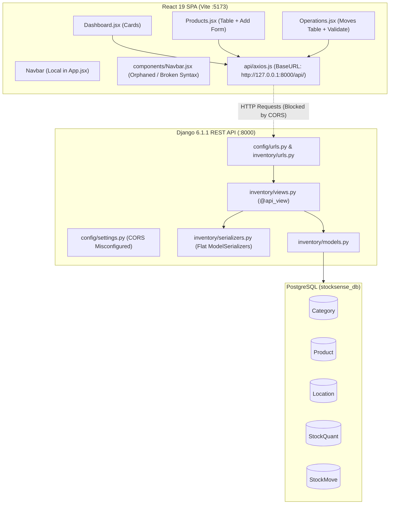

# StockSense — Comprehensive Architecture & Code Audit Report
**Odoo Hackathon 2026 | Technical Evaluation & Gap Analysis**  
**Role:** Senior Software Architect & Code Auditor  
**Date:** September 26, 2026  
**Project Workspace:** `d:\LPU hack\Stocksense`  
**Git Branch:** `main` (Commit: `a275ddb`)  

---

## Executive Summary

StockSense is an Inventory Management System (IMS) inspired by Odoo's double-entry stock accounting principles. The codebase currently comprises:
1. **Django 6.1.1 + Django REST Framework** backend exposing 8 API endpoints.
2. **React 19 + Vite 8 + React Router 7** single-page frontend with 3 visible views (`Dashboard`, `Products`, `Operations`).
3. **PostgreSQL** database connection (`stocksense_db`) with 5 core tables (`Category`, `Product`, `Location`, `StockQuant`, `StockMove`).

### Primary Finding & Hackathon Risk
While the core concept of a double-entry stock ledger (`StockMove` driving `StockQuant` via database transactions) has been initiated, **the application in its current state is non-functional in end-to-end browser use** due to three immediate blockers:
- **CORS Blocker:** Missing `CORS_ALLOW_ALL_ORIGINS` / `CORS_ALLOWED_ORIGINS` in `config/settings.py` and `CorsMiddleware` placed at the bottom of middleware prevents Vite (`http://localhost:5173`) from communicating with Django (`http://127.0.0.1:8000`).
- **Foreign Key Violation on Product Creation:** The frontend hardcodes `category = "1"`, but the database contains zero categories, causing `POST /api/products/` to fail with HTTP 400 Bad Request immediately.
- **Missing Odoo Core Entities:** No `Warehouse` model, no multi-item document headers (`Receipt`, `DeliveryOrder`, `InternalTransfer`), no `User`/`Supplier`/`Customer` references, and zero authentication / OTP infrastructure.

---

## A. Current Project Architecture

### 1. Technology Stack Breakdown
| Layer | Technology | Version | Location / Config |
| :--- | :--- | :--- | :--- |
| **Backend Framework** | Django | `6.1.1` | [`config/settings.py`](file:///d:/LPU%20hack/Stocksense/config/settings.py) |
| **API Framework** | Django REST Framework (DRF) | `3.15+` | `inventory/views.py` (`@api_view`) |
| **Database** | PostgreSQL | `16+` (port 5432) | Database: `stocksense_db`, User: `stocksense_user` |
| **Frontend Framework** | React | `19.2.8` | [`stocksense-frontend/package.json`](file:///d:/LPU%20hack/Stocksense/stocksense-frontend/package.json) |
| **Frontend Bundler** | Vite | `8.3.0` | [`stocksense-frontend/vite.config.js`](file:///d:/LPU%20hack/Stocksense/stocksense-frontend/vite.config.js) |
| **Routing** | React Router DOM | `7.18.4` | [`stocksense-frontend/src/App.jsx`](file:///d:/LPU%20hack/Stocksense/stocksense-frontend/src/App.jsx) |
| **HTTP Client** | Axios | `1.20.0` | [`stocksense-frontend/src/api/axios.js`](file:///d:/LPU%20hack/Stocksense/stocksense-frontend/src/api/axios.js) |
| **Icons Library** | Lucide React | `1.48.0` | Installed in `package.json`, currently unused |
| **Frontend Linter** | Oxlint | `1.81.0` | [`stocksense-frontend/.oxlintrc.json`](file:///d:/LPU%20hack/Stocksense/stocksense-frontend/.oxlintrc.json) |
| **Styling** | Vanilla CSS / Inline JSX | N/A | Default Vite styles in `index.css`, `App.css` |
| **State Management** | React Local State (`useState`) | N/A | No global store (Redux/Zustand/Context API) |
| **Authentication** | Django Auth (Inactive) | `django.contrib.auth` | No JWT, Token, Session, or OTP configured |

### 2. Architecture Diagram (Current State)


---

## B. Current Feature Status Table

Classification Legend:
- 🟢 **COMPLETE**: Fully meets requirement with frontend UI, backend logic, and persistence.
- 🟡 **PARTIALLY COMPLETE**: Backend or frontend started, but missing critical operations or fields.
- 🔴 **NOT IMPLEMENTED**: Zero code exists for this requirement.
- 🔵 **IMPLEMENTED BUT NEEDS TESTING**: Logic implemented end-to-end but unverified under realistic edge cases.
- ⚠️ **IMPLEMENTED BUT HAS A PROBLEM**: Code exists but contains architectural defects, logic bugs, or runtime failures.

| # | Feature | Status | Evidence | Files Involved | What is Working | What is Missing | What Needs to be Tested |
| :--- | :--- | :--- | :--- | :--- | :--- | :--- | :--- | :--- |
| **1** | **Authentication** | 🔴 NOT IMPLEMENTED | No auth URLs, models, or views in backend; no login/signup/OTP pages in React. | `config/settings.py`, `inventory/views.py`, `stocksense-frontend/src/App.jsx` | Nothing. | Signup, Login, JWT/Token handling, OTP reset, auth state, route guards. | Everything once implemented. |
| **2** | **Dashboard** | ⚠️ IMPLEMENTED BUT HAS A PROBLEM | `Dashboard.jsx` renders 5 KPI cards via `GET /api/kpis/`. | `inventory/views.py:104`, `stocksense-frontend/src/pages/Dashboard.jsx` | Fetches and displays 5 summary metric counters. | Dynamic filters (doc type, status, warehouse, location, category); drill-down navigation; CORS header failure. | CORS bypass test; KPI card re-render on data change. |
| **3** | **Products** | ⚠️ IMPLEMENTED BUT HAS A PROBLEM | `Product` model exists, `GET /api/products/` works, `POST` fails due to hardcoded category `'1'`. | `inventory/models.py:12`, `inventory/views.py:20`, `stocksense-frontend/src/pages/Products.jsx` | Listing products (`id`, `name`, `sku`, `reorder_level`). | Dynamic category dropdown; UOM input; initial stock input; product update/delete endpoints; stock by location breakdown. | Product creation with valid Category ID; handling duplicate SKU constraint. |
| **4** | **Product Categories** | 🟡 PARTIALLY COMPLETE | `Category` model exists; `GET /api/categories/` exists. | `inventory/models.py:5`, `inventory/views.py:142`, `inventory/urls.py:10` | Reading category list via GET API. | Category creation/editing/deletion (POST/PUT/DELETE); frontend category management view. | API response when database has zero categories. |
| **5** | **Warehouse** | 🔴 NOT IMPLEMENTED | Zero mentions of a `Warehouse` model or table. | `inventory/models.py`, `inventory/views.py` | Nothing. | `Warehouse` model (name, code, address); warehouse CRUD APIs; link to locations; frontend views. | Everything once implemented. |
| **6** | **Locations** | 🟡 PARTIALLY COMPLETE | `Location` model with `type` choices (`vendor`, `internal`, `customer`, `adjustment`); `GET /api/locations/`. | `inventory/models.py:23`, `inventory/views.py:136`, `inventory/urls.py:9` | Reading locations via API. | Location creation/editing/deletion (POST/PUT/DELETE); location code; parent warehouse foreign key; frontend UI. | Verification of location types during move processing. |
| **7** | **Receipts (Incoming)** | ⚠️ IMPLEMENTED BUT HAS A PROBLEM | `StockMove` with `doc_type='receipt'` validated via `validate_move`. | `inventory/models.py:49`, `inventory/views.py:64`, `stocksense-frontend/src/pages/Operations.jsx` | Move validation increases destination internal quant and marks status `done`. | Multi-item receipt header; supplier selection; reference document number; frontend create receipt form. | Receipt validation with newly created products; stock increase verification. |
| **8** | **Delivery Orders (Outgoing)** | ⚠️ IMPLEMENTED BUT HAS A PROBLEM | `StockMove` with `doc_type='delivery'` validated via `validate_move`. | `inventory/models.py:49`, `inventory/views.py:64`, `stocksense-frontend/src/pages/Operations.jsx` | Move validation deducts source internal quant and marks status `done`. | Negative stock prevention (allows deduction below 0); customer selection; pick/pack status workflow; frontend create delivery form. | Validating delivery order when available stock is less than requested quantity. |
| **9** | **Internal Transfers** | ⚠️ IMPLEMENTED BUT HAS A PROBLEM | `StockMove` with `doc_type='internal'` validated via `validate_move`. | `inventory/models.py:49`, `inventory/views.py:64`, `stocksense-frontend/src/pages/Operations.jsx` | Deducts from source quant, adds to destination quant inside atomic transaction. Total company stock constant. | Negative stock prevention in source location; warehouse-to-warehouse mapping; multi-item transfer form in frontend. | Transfer between two internal locations with zero source stock. |
| **10** | **Stock Adjustments** | ⚠️ IMPLEMENTED BUT HAS A PROBLEM | `StockMove` supports `doc_type='adjustment'`. | `inventory/models.py:49`, `inventory/views.py:64` | Move can be created manually in DB with status done. | Discrepancy calculation endpoint (`counted_qty - system_qty`); automated adjustment move generator; frontend adjustment interface. | Positive vs negative adjustment quant deduction logic against virtual adjustment locations. |
| **11** | **Stock Ledger** | 🟡 PARTIALLY COMPLETE | `StockQuant` tracks on-hand balances per location; `StockMove` records transitions. | `inventory/models.py:37, 49`, `inventory/views.py:64` | Atomic quant updates upon move validation. | Snapshot of previous quantity and new quantity per move; user/operator audit trail; reference document tracking. | Concurrent validations modifying identical `(product, location)` quants. |
| **12** | **Move History** | 🟡 PARTIALLY COMPLETE | `GET /api/moves/` returns all moves; `Operations.jsx` lists them in a table. | `inventory/views.py:38`, `stocksense-frontend/src/pages/Operations.jsx` | Displays table of moves with doc_type, raw product ID, qty, status. | Human-readable product names/SKUs; from/to location names; timestamp; dedicated `/moves` route and view. | Displaying moves when database contains hundreds of entries (pagination). |
| **13** | **Low Stock Alerts** | 🟡 PARTIALLY COMPLETE | `get_dashboard_kpis` computes products where internal sum <= `reorder_level`. | `inventory/views.py:112`, `stocksense-frontend/src/pages/Dashboard.jsx` | Counter card displayed on dashboard. | Dedicated low-stock alert list/table; visual badge on product page; out-of-stock vs low-stock distinction. | Accurate calculation when a product has stock in multiple internal locations. |
| **14** | **Reordering Rules** | 🟡 PARTIALLY COMPLETE | `reorder_level` integer field exists on `Product` with default 10. | `inventory/models.py:17` | Stores integer threshold per product. | Reorder rule form in UI; minimum/maximum quantity rules; per-location reorder rules; automated PO draft generation. | Product creation with custom reorder level. |
| **15** | **Search Functionality** | 🔴 NOT IMPLEMENTED | Zero search query parameters in Django views; zero search input bars in React. | `inventory/views.py`, `stocksense-frontend/src/pages/Products.jsx` | Nothing. | SKU search, Product name search, Reference search, Location search. | Everything once implemented. |
| **16** | **Dynamic Filters** | 🟡 PARTIALLY COMPLETE | `stock_move_list` supports `?doc_type=` and `?status=`. | `inventory/views.py:41-48` | Backend query parameter filtering for moves. | Frontend filter UI controls; backend filters for warehouse, location, product category; dashboard KPI filtering. | Filter combinations (e.g. `doc_type=receipt&status=ready`). |
| **17** | **Dashboard KPIs** | ⚠️ IMPLEMENTED BUT HAS A PROBLEM | `GET /api/kpis/` returns 5 metrics. | `inventory/views.py:104-130`, `stocksense-frontend/src/pages/Dashboard.jsx` | Computes total products, low stock, pending receipts, pending deliveries, internal transfers. | N+1 query performance bug in `views.py:114`; does not accept dynamic filter params; "Total Products" counts items with 0 stock. | KPI response time with large product catalog. |
| **18** | **User Profile** | 🔴 NOT IMPLEMENTED | No profile model, endpoint, or frontend component. | `stocksense-frontend/src/App.jsx` | Nothing. | User profile page, role display (Manager vs Warehouse Staff), profile settings. | Everything once implemented. |
| **19** | **Logout** | 🔴 NOT IMPLEMENTED | No auth token deletion or logout handler. | `stocksense-frontend/src/App.jsx` | Nothing. | Logout button, token invalidation, redirect to login page. | Everything once implemented. |
| **20** | **Overall Navigation** | ⚠️ IMPLEMENTED BUT HAS A PROBLEM | Inline sidebar in `App.jsx` with 3 links (`Dashboard`, `Products`, `Operations`). | `stocksense-frontend/src/App.jsx:8`, `stocksense-frontend/src/components/Navbar.jsx` | Basic client-side navigation between 3 pages. | Links for Receipts, Deliveries, Adjustments, Move History, Warehouses, Locations, Settings, Profile; broken orphaned `Navbar.jsx`. | Active route highlighting, responsive sidebar collapse. |

---

## C. Database Audit

### 1. Existing Database Models

#### `Category` (`inventory_category`)
- **Fields:**
  - `id`: `BigAutoField`, Primary Key, Auto Increment.
  - `name`: `CharField(max_length=100)`.
- **Relationships:** Referenced by `Product.category` (`CASCADE`).
- **Constraints / Indexes:** Implicit primary key index.
- **Purpose:** Groups products (e.g., "Raw Materials", "Finished Goods").

#### `Product` (`inventory_product`)
- **Fields:**
  - `id`: `BigAutoField`, Primary Key, Auto Increment.
  - `name`: `CharField(max_length=200)`.
  - `sku`: `CharField(max_length=100, unique=True)`.
  - `category_id`: `BigIntegerField`, Foreign Key -> `Category.id` (`ON DELETE CASCADE`).
  - `uom`: `CharField(max_length=50, default='Units')`.
  - `reorder_level`: `IntegerField(default=10)`.
- **Relationships:**
  - `category`: Many-to-One with `Category`.
  - Reverse relations: `stockquant_set`, `stockmove_set`.
- **Constraints / Indexes:** Unique index on `sku`.
- **Purpose:** Central product master record.

#### `Location` (`inventory_location`)
- **Fields:**
  - `id`: `BigAutoField`, Primary Key, Auto Increment.
  - `name`: `CharField(max_length=100)`.
  - `type`: `CharField(max_length=20, choices=['vendor', 'internal', 'customer', 'adjustment'])`.
- **Relationships:** Referenced by `StockQuant.location`, `StockMove.from_location`, `StockMove.to_location`.
- **Constraints / Indexes:** Implicit primary key index.
- **Purpose:** Defines physical or virtual zones where stock resides.

#### `StockQuant` (`inventory_stockquant`)
- **Fields:**
  - `id`: `BigAutoField`, Primary Key, Auto Increment.
  - `product_id`: `BigIntegerField`, Foreign Key -> `Product.id` (`ON DELETE CASCADE`).
  - `location_id`: `BigIntegerField`, Foreign Key -> `Location.id` (`ON DELETE CASCADE`).
  - `quantity`: `DecimalField(max_digits=10, decimal_places=2, default=0.00)`.
- **Relationships:** Many-to-One with `Product` and `Location`.
- **Constraints / Indexes:** `unique_together = ('product', 'location')`.
- **Purpose:** Represents the real-time physical/virtual stock balance of a single product at a specific location.

#### `StockMove` (`inventory_stockmove`)
- **Fields:**
  - `id`: `BigAutoField`, Primary Key, Auto Increment.
  - `doc_type`: `CharField(max_length=20, choices=['receipt', 'delivery', 'internal', 'adjustment'])`.
  - `product_id`: `BigIntegerField`, Foreign Key -> `Product.id` (`ON DELETE CASCADE`).
  - `qty`: `DecimalField(max_digits=10, decimal_places=2)`.
  - `from_location_id`: `BigIntegerField`, Foreign Key -> `Location.id` (`related_name='moves_from'`).
  - `to_location_id`: `BigIntegerField`, Foreign Key -> `Location.id` (`related_name='moves_to'`).
  - `status`: `CharField(max_length=20, choices=['draft', 'ready', 'done', 'canceled'], default='draft')`.
  - `created_at`: `DateTimeField(auto_now_add=True)`.
- **Relationships:** Many-to-One with `Product`, `from_location` (`Location`), `to_location` (`Location`).
- **Constraints / Indexes:** Implicit primary key index.
- **Purpose:** Double-entry stock ledger record tracking goods moving from one location to another.

#### `User` (`auth_user`)
- Standard Django built-in user model (tables migrated in `auth`), but **completely decoupled from all inventory tables**.

---

### 2. Missing Database Models & Relationships
To satisfy Odoo Hackathon specifications, the following models/relationships are currently missing:

```
MISSING INVENTORY ENTITIES:
├── Warehouse (name, code, address, company)
│   └── Relationship: Location.warehouse_id (Many-to-One)
│
├── Partner / Contact (name, type: ['supplier', 'customer'], email, phone)
│   └── Relationship: DocumentHeader.partner_id
│
├── Document Headers (Multi-Item Operations):
│   ├── StockPicking / OperationHeader (reference e.g. WH/IN/0001, partner, picking_type, status, scheduled_date)
│   └── StockMove.picking_id (Foreign Key linking multiple items to one document)
│
├── StockAudit / Move Ledger Enhancements:
│   ├── StockMove.created_by (Foreign Key -> auth.User)
│   ├── StockMove.previous_qty (DecimalField)
│   ├── StockMove.new_qty (DecimalField)
│   └── StockMove.reference (CharField e.g., 'WH/IN/0001')
│
└── ReorderingRule (min_qty, max_qty, location, product)
```

---

## D. Stock Logic & Lifecycle Audit

The application adopts Odoo's double-entry stock paradigm. In theory, stock is never created or destroyed; it is moved between virtual locations (`vendor`, `customer`, `adjustment`) and physical locations (`internal`).

```
Odoo Double-Entry Movement Model:
  Vendor Location (Virtual)     ──[Receipt +qty]──►   Internal Warehouse (Physical)
  Internal Warehouse (Physical) ──[Delivery -qty]─►   Customer Location (Virtual)
  Internal A (Physical)         ──[Transfer]─────►   Internal B (Physical)
  Adjustment Location (Virtual) ◄─[Adjustment]────►   Internal Warehouse (Physical)
```

### Detailed Lifecycle Trace

#### A. Product is Created
- **Execution:** User posts `{ name, sku, category }` to `/api/products/`.
- **Before Stock:** Product does not exist.
- **Operation:** Record inserted into `inventory_product`.
- **Database Update:** No entry created in `StockQuant` or `StockMove`.
- **After Stock:** Stock is undefined (no quant exists).
- **Ledger/History Entry:** None.
- **Risk:** Product has no initial stock and no quant row until first move validation.

#### B. Initial Stock is Added
- **Current Capability:** **Not supported in application code.**
- **Required Behavior:** Should create a move from `Location(type='adjustment')` to `Location(type='internal')` with `status='done'` and initialize `StockQuant`.

#### C. Receipt is Validated (`validate_move`)
- **Execution:** `POST /api/moves/<move_id>/validate/` where `doc_type='receipt'`.
- **Before Stock:** Source is `vendor`, destination is `internal` (e.g., current quant = 10).
- **Operation:**
  - `move.from_location.type != 'vendor'` is `False` $\rightarrow$ No deduction from vendor quant.
  - `move.to_location.type != 'customer'` is `True` $\rightarrow$ `dest_quant.quantity += move.qty`.
  - `move.status = 'done'`.
- **Database Update:** `inventory_stockquant` updated/created (`quantity = 10 + 50 = 60`). `inventory_stockmove.status = 'done'`.
- **After Stock:** Internal quant increases by 50.
- **Ledger Entry:** `StockMove` marked `done`.
- **Risk:** If `from_location` was mistakenly configured as internal, vendor stock would be deducted.

#### D. Delivery is Validated (`validate_move`)
- **Execution:** `POST /api/moves/<move_id>/validate/` where `doc_type='delivery'`.
- **Before Stock:** Source is `internal` (current quant = 5), destination is `customer`. Move qty = 10.
- **Operation:**
  - `move.from_location.type != 'vendor'` is `True` $\rightarrow$ `src_quant.quantity -= move.qty` ($5 - 10 = -5$).
  - `move.to_location.type != 'customer'` is `False` $\rightarrow$ Customer quant unchanged.
  - `move.status = 'done'`.
- **Database Update:** `inventory_stockquant.quantity = -5.00`.
- **After Stock:** **Stock becomes -5.00 (Negative Stock)!**
- **Critical Risk:** **There is ZERO inventory reservation or negative stock check.** Deliveries can be validated regardless of available stock.

#### E. Internal Transfer is Completed (`validate_move`)
- **Execution:** `POST /api/moves/<move_id>/validate/` where `doc_type='internal'`.
- **Before Stock:** Source is `Rack A` (quant = 15), Destination is `Rack B` (quant = 0). Qty = 5.
- **Operation:**
  - `src_quant.quantity -= 5` $\rightarrow$ 10.
  - `dest_quant.quantity += 5` $\rightarrow$ 5.
  - Total company stock: $10 + 5 = 15$ (Preserved).
- **Database Update:** Both quants updated inside `transaction.atomic()`.
- **Ledger Entry:** `StockMove.status = 'done'`.
- **Risk:** No check if `from_location == to_location`. No check if source has enough stock.

#### F. Stock Adjustment is Confirmed
- **Current State:** The backend has **no specialized adjustment logic**.
- **What Happens Now:** The user must manually determine whether discrepancy is positive or negative, manually create a `StockMove` with `from_location` and `to_location`, and validate it.
- **Flaw in `validate_move` for Adjustments:**
  Lines 77 & 86 check:
  `if move.from_location.type != 'vendor': deduct`
  `if move.to_location.type != 'customer': add`
  When an adjustment move is executed:
  - If `from_location` is `adjustment` (virtual) and `to_location` is `internal`:
    `from_location.type` is `'adjustment'`, which is `!= 'vendor'`!
    Therefore, the code creates a `StockQuant` for the virtual adjustment location and subtracts stock from it!
  - If `from_location` is `internal` and `to_location` is `adjustment`:
    `to_location.type` is `'adjustment'`, which is `!= 'customer'`!
    Therefore, the code creates a `StockQuant` for the virtual adjustment location and adds stock to it!
  While virtual balances can exist mathematically, leaving them unbounded without an explicit `adjustment` location check pollutes `StockQuant`.

---

## E. API Audit

### API Endpoints Summary Table
| METHOD | ENDPOINT | PURPOSE | IMPLEMENTED | FRONTEND CONNECTED |
| :--- | :--- | :--- | :--- | :--- |
| `GET` | `/api/products/` | List all products | **YES** | **YES** (`Products.jsx`) |
| `POST` | `/api/products/` | Create a product | **YES** | **YES** (`Products.jsx` - fails on category) |
| `GET` | `/api/moves/` | List stock moves (filters: `doc_type`, `status`) | **YES** | **YES** (`Operations.jsx`) |
| `POST` | `/api/moves/` | Create a stock move | **YES** | **NO** (No form in frontend) |
| `POST` | `/api/moves/<id>/validate/`| Execute double-entry move & update quants | **YES** | **YES** (`Operations.jsx`) |
| `GET` | `/api/kpis/` | Get summary counts for dashboard | **YES** | **YES** (`Dashboard.jsx`) |
| `GET` | `/api/locations/` | List all locations | **YES** | **NO** (Never fetched by frontend) |
| `GET` | `/api/categories/` | List all categories | **YES** | **NO** (Never fetched by frontend) |

### Missing APIs Required for Odoo IMS
1. `GET /api/products/<id>/` (Product details + location-wise stock breakdown)
2. `PUT / PATCH / DELETE /api/products/<id>/` (Update / Delete product)
3. `POST /api/categories/` (Create product category)
4. `GET / POST / PUT / DELETE /api/warehouses/` (Warehouse management)
5. `POST / PUT / DELETE /api/locations/` (Location management)
6. `POST /api/adjustments/` or `POST /api/adjustments/apply/` (Counted quantity vs system quantity adjustment)
7. `GET /api/moves/<id>/` (Detailed move view)
8. `POST /api/auth/signup/` (User registration)
9. `POST /api/auth/login/` (User authentication / JWT token generation)
10. `POST /api/auth/password-reset-otp/` (OTP generation & dispatch)
11. `POST /api/auth/password-reset-confirm/` (OTP verification & password reset)
12. `GET /api/auth/profile/` (Authenticated user profile)

---

## F. Frontend Audit

| Route / View | UI Exists? | API Connected? | Data Loading? | Create? | Update? | Delete? | Form Validation? | Loading State? | Error Handling? | Empty State? | Success Feedback? |
| :--- | :--- | :--- | :--- | :--- | :--- | :--- | :--- | :--- | :--- | :--- | :--- |
| **`/` (`Dashboard`)** | Yes | Yes (`/api/kpis/`) | Yes (`useEffect`) | N/A | N/A | N/A | N/A | ❌ No | ❌ Only `console.error` | ❌ No | N/A |
| **`/products` (`Products`)** | Yes | Yes (`/api/products/`) | Yes (`useEffect`) | ⚠️ Broken (hardcoded cat 1) | ❌ No | ❌ No | ⚠️ HTML `required` only | ❌ No | ⚠️ `alert('Failed...')` | ❌ Blank table | ❌ No |
| **`/operations` (`Operations`)** | Yes | Yes (`/api/moves/`) | Yes (`useEffect`) | ❌ No creation form | ⚠️ Only Validate | ❌ No | N/A | ❌ No | ⚠️ Browser `alert()` | ❌ Blank table | ⚠️ Browser `alert()` |
| **`/moves` (`Move History`)** | ❌ Orphaned in dead Navbar | ❌ Route not registered | ❌ No | ❌ No | ❌ No | ❌ No | ❌ No | ❌ No | ❌ No | ❌ No | ❌ No |
| **`/receipts`** | ❌ Does not exist | ❌ No | ❌ No | ❌ No | ❌ No | ❌ No | ❌ No | ❌ No | ❌ No | ❌ No | ❌ No |
| **`/deliveries`** | ❌ Does not exist | ❌ No | ❌ No | ❌ No | ❌ No | ❌ No | ❌ No | ❌ No | ❌ No | ❌ No | ❌ No |
| **`/transfers`** | ❌ Does not exist | ❌ No | ❌ No | ❌ No | ❌ No | ❌ No | ❌ No | ❌ No | ❌ No | ❌ No | ❌ No |
| **`/adjustments`** | ❌ Does not exist | ❌ No | ❌ No | ❌ No | ❌ No | ❌ No | ❌ No | ❌ No | ❌ No | ❌ No | ❌ No |
| **`/warehouses`** | ❌ Does not exist | ❌ No | ❌ No | ❌ No | ❌ No | ❌ No | ❌ No | ❌ No | ❌ No | ❌ No | ❌ No |
| **`/locations`** | ❌ Does not exist | ❌ No | ❌ No | ❌ No | ❌ No | ❌ No | ❌ No | ❌ No | ❌ No | ❌ No | ❌ No |
| **`/login` / `/signup`** | ❌ Does not exist | ❌ No | ❌ No | ❌ No | ❌ No | ❌ No | ❌ No | ❌ No | ❌ No | ❌ No | ❌ No |

---

## G. Bug & Risk Audit

### 1. Critical Runtime Blockers
1. **CORS Headers Missing (`config/settings.py`)**:
   - `CorsMiddleware` is on line 53 (at the very end of `MIDDLEWARE`), violating `django-cors-headers` documentation which requires it before `CommonMiddleware`.
   - `CORS_ALLOWED_ORIGINS` or `CORS_ALLOW_ALL_ORIGINS = True` is not set.
   - Result: In any standard web browser, all requests from Vite (`http://localhost:5173`) are rejected by browser CORS security.
2. **Category Foreign Key Failure on Product Creation (`src/pages/Products.jsx:8`)**:
   - `const [category, setCategory] = useState('1');`
   - Initial database has 0 categories. Submitting the form results in `{"category": ["Invalid pk \"1\" - object does not exist."]}`.
3. **Broken Orphaned Component (`src/components/Navbar.jsx:2`)**:
   - Contains a syntax error: `import { Link } from 'react{cite: 1, 2}-router-dom';`.
   - Vite builds only because this file is not imported by `App.jsx`. If imported, Vite build immediately fails.

### 2. Logic & Data Integrity Risks
4. **Negative Stock Vulnerability (`inventory/views.py:82`)**:
   - In `validate_move`, `src_quant.quantity -= move.qty` executes without validating whether `src_quant.quantity >= move.qty`. Deliveries can create negative stock balances.
5. **Canceled Moves Can Be Validated (`inventory/views.py:71`)**:
   - Only checks `if move.status == 'done': error`. A move with `status='canceled'` will be executed and mutate inventory stock.
6. **No Validation on Quantities (`inventory/serializers.py:24`)**:
   - `qty` can be 0 or negative. A negative delivery move would actually *increase* inventory!
7. **Same Location Move Loop (`inventory/views.py:64`)**:
   - Does not validate `from_location != to_location`.
8. **N+1 Database Query in KPIs Endpoint (`inventory/views.py:114-122`)**:
   - `for product in products: StockQuant.objects.filter(product=product, location__type='internal').aggregate(...)`
   - Fires a separate query for every single product in the database.
9. **Raw Foreign Key IDs in Frontend (`src/pages/Operations.jsx:39`)**:
   - Displays `m.product` (e.g. `1`), instead of Product Name and SKU. Does not show Location names.

### 3. Code Hygiene & Configuration Issues
10. **Hardcoded Database Credentials (`config/settings.py:87-93`)**:
    - Database password `'admin123'` and user `'stocksense_user'` committed directly to version control.
11. **Models Not Registered in Django Admin (`inventory/admin.py`)**:
    - Admin interface is completely blank.
12. **Zero Automated Tests (`inventory/tests.py`)**:
    - File contains only boilerplate.
13. **Unused Frontend Dependencies**:
    - `lucide-react` is installed in `package.json` but not used.
14. **CSS Layout Clipping (`stocksense-frontend/src/index.css:57`)**:
    - `#root { width: 1126px; text-align: center; }` restricts full-screen dashboard rendering and centers dashboard text.
15. **Browser `alert()` Spams**:
    - Validation failures and success alerts use blocking `alert()` calls instead of modern toast notifications.

---

## H. Missing Features List

### Authentication & User Management
- [ ] User Signup API & UI form.
- [ ] User Login API with Token / JWT generation & storage.
- [ ] OTP-based password reset workflow (Console email backend configured in Django `settings.py`, but no view/logic).
- [ ] Protected routes (`PrivateRoute` guard in React).
- [ ] Role distinction (Inventory Manager vs Warehouse Staff).
- [ ] User profile view and logout button.

### Warehouse & Locations
- [ ] `Warehouse` database model (name, code, address).
- [ ] CRUD APIs for Warehouses.
- [ ] Warehouse UI page with create/update modal.
- [ ] Location hierarchy linked to Warehouses (`Location.warehouse`).
- [ ] Location code field (e.g., `WH/STOCK`, `WH/OUTPUT`).
- [ ] Location UI page with create/update modal.

### Operations & Movements
- [ ] Multi-item Document Header model (`StockPicking` or `OperationHeader`).
- [ ] Sequential reference number generator (e.g. `WH/IN/00001`, `WH/OUT/00001`).
- [ ] Receipt Creation Form (Select Supplier, Add Products, Enter Qty).
- [ ] Delivery Order Creation Form (Select Customer, Add Products, Enter Qty, Check Availability).
- [ ] Internal Transfer Form (Source Location $\rightarrow$ Destination Location, Products).
- [ ] Stock Adjustment Interface (Select Product + Location, Input Counted Qty, System computes discrepancy, Auto-creates adjustment move).
- [ ] Move History View with Product Name, SKU, Locations, User, Previous/New Qty, Timestamp.

### Filtering, Search & Dashboard
- [ ] Dynamic filters on Dashboard & Operations (By doc type, status, warehouse, location, category).
- [ ] Search bar by SKU, Product Name, and Reference Document.
- [ ] Low-stock drilldown table showing exactly which products need reordering.
- [ ] Reordering rule management UI (Min Qty, Max Qty).

---

## I. Dependency Order

To build the remaining requirements systematically without rework, follow this architectural dependency graph:

```
[Phase 1: Foundation & Infrastructure]
  ├── Fix Settings (CORS headers, Middleware position)
  ├── Register Models in Django Admin
  └── Implement Clean Global Layout & Toast System
            │
            ▼
[Phase 2: Master Data Models & APIs]
  ├── Category CRUD (Backend + Frontend)
  ├── Warehouse Model & CRUD (Backend + Frontend)
  └── Location Model Enhancement (Link to Warehouse + Location Code)
            │
            ▼
[Phase 3: Product Management Overhaul]
  ├── Product Model Enhancement (UOM, Reorder Level, Image, Description)
  ├── Product Creation with Dynamic Category & Location Availability
  └── Initial Stock Seeding Mechanism
            │
            ▼
[Phase 4: Stock Engine & Validation Hardening]
  ├── Prevent Negative Stock on Outgoing Moves
  ├── Restrict Validations (Reject Canceled Moves, Validate Qty > 0)
  ├── Serializer Expansion (Include Product Name, SKU, Location Names)
  └── Discrepancy Calculation for Stock Adjustments
            │
            ▼
[Phase 5: Operations UI & Document Flows]
  ├── Receipts Management (Supplier, Reference, Line Items, Validate)
  ├── Delivery Orders Management (Customer, Check Stock, Validate)
  ├── Internal Transfers Management (Source -> Dest, Validate)
  └── Stock Adjustments Management (Counted vs System Qty)
            │
            ▼
[Phase 6: Traceability, Filters & Dashboard]
  ├── Move History View (Full Audit Ledger: User, Timestamp, Prev/New Qty)
  ├── Dynamic Filtering & Global SKU Search
  └── Dashboard Optimization (Fix N+1 Query, Connect Filter Params, Drilldowns)
            │
            ▼
[Phase 7: Authentication & Access Control]
  ├── User Signup & Login (JWT / Session)
  ├── OTP Password Reset Flow
  └── User Profile, Role Guards (Manager vs Staff), & Logout
```

---

## J. Exact Next Steps (Numbered Implementation Plan)

This step-by-step roadmap references the **exact files, folders, models, APIs, components, and functions** in the project.

### Step 1: Repair Critical Configuration & Unblock Communication
1. **Fix Middleware & CORS in [`config/settings.py`](file:///d:/LPU%20hack/Stocksense/config/settings.py)**:
   - Move `'corsheaders.middleware.CorsMiddleware'` to line 46 (at the very top of `MIDDLEWARE`, above `CommonMiddleware`).
   - Add `CORS_ALLOW_ALL_ORIGINS = True` (or configure `CORS_ALLOWED_ORIGINS = ['http://localhost:5173', 'http://127.0.0.1:5173']`).
2. **Fix Syntax Error in [`stocksense-frontend/src/components/Navbar.jsx`](file:///d:/LPU%20hack/Stocksense/stocksense-frontend/src/components/Navbar.jsx)**:
   - Fix line 2 import from `'react{cite: 1, 2}-router-dom'` to `'react-router-dom'`.
   - Update [`stocksense-frontend/src/App.jsx`](file:///d:/LPU%20hack/Stocksense/stocksense-frontend/src/App.jsx) to import and use the component from `components/Navbar.jsx` instead of keeping a duplicate function.
3. **Register Existing Models in [`inventory/admin.py`](file:///d:/LPU%20hack/Stocksense/inventory/admin.py)**:
   - Register `Category`, `Product`, `Location`, `StockQuant`, and `StockMove` so data can be verified and managed via Django Admin.

### Step 2: Fix Category & Product Creation in Frontend & Backend
1. **Fetch Dynamic Categories in [`stocksense-frontend/src/pages/Products.jsx`](file:///d:/LPU%20hack/Stocksense/stocksense-frontend/src/pages/Products.jsx)**:
   - Replace `useState('1')` on line 8 with dynamic state fetched from `GET /api/categories/`.
   - Add a `<select>` dropdown in the form for Category selection.
   - Add inputs for `uom` and `reorder_level`.
2. **Add Category Creation in Backend [`inventory/views.py`](file:///d:/LPU%20hack/Stocksense/inventory/views.py)**:
   - Update `category_list` to accept `POST` requests so categories can be added directly.
3. **Enhance [`inventory/serializers.py`](file:///d:/LPU%20hack/Stocksense/inventory/serializers.py)**:
   - In `ProductSerializer`, include `category_name = serializers.CharField(source='category.name', read_only=True)`.
   - In `StockMoveSerializer`, include `product_name`, `product_sku`, `from_location_name`, and `to_location_name`.

### Step 3: Implement Warehouse Entity & Link to Locations
1. **Create `Warehouse` Model in [`inventory/models.py`](file:///d:/LPU%20hack/Stocksense/inventory/models.py)**:
   - Fields: `name`, `code` (e.g. `WH`), `address`.
   - Add `warehouse = models.ForeignKey(Warehouse, on_delete=models.CASCADE, null=True, blank=True)` to `Location`.
2. **Run Migrations**:
   - `python manage.py makemigrations inventory`
   - `python manage.py migrate`
3. **Expose Warehouse APIs in [`inventory/views.py`](file:///d:/LPU%20hack/Stocksense/inventory/views.py) and [`inventory/urls.py`](file:///d:/LPU%20hack/Stocksense/inventory/urls.py)**:
   - Implement `warehouse_list` (`GET`, `POST`).
4. **Create Warehouse View in Frontend**:
   - Create `src/pages/Warehouses.jsx` and add route `/warehouses` in `App.jsx`.

### Step 4: Harden Stock Movement Engine & Prevent Negative Balances
1. **Update `validate_move` in [`inventory/views.py`](file:///d:/LPU%20hack/Stocksense/inventory/views.py:64)**:
   - Check move status: reject if `move.status in ['done', 'canceled']`.
   - Check quantity: reject if `move.qty <= 0`.
   - Check negative stock: if `move.from_location.type == 'internal'`, verify `src_quant.quantity >= move.qty`. If not, return HTTP 400 Bad Request with `"Insufficient stock at source location"`.
   - Handle virtual adjustment locations explicitly so virtual quants are not unnecessarily accumulated.
2. **Add Single Move Detail & Cancel Endpoints**:
   - `moves/<int:move_id>/cancel/` to mark a draft move as canceled.

### Step 5: Implement Dedicated Operations Pages (Receipts, Deliveries, Transfers, Adjustments)
1. **Split Operations into Dedicated Pages or Sub-tabs**:
   - Instead of a single flat table in [`Operations.jsx`](file:///d:/LPU%20hack/Stocksense/stocksense-frontend/src/pages/Operations.jsx), create:
     - `src/pages/Receipts.jsx`: Table filtered by `doc_type=receipt` + "New Receipt" modal.
     - `src/pages/Deliveries.jsx`: Table filtered by `doc_type=delivery` + "New Delivery" modal with stock availability indicator.
     - `src/pages/Transfers.jsx`: Table filtered by `doc_type=internal` + "New Transfer" modal.
     - `src/pages/Adjustments.jsx`: Counted quantity input form calculating discrepancy automatically.
2. **Connect Operations Creation to Backend**:
   - Connect modal submission to `POST /api/moves/` with proper `from_location` and `to_location`.

### Step 6: Fix Move History & Audit Trail
1. **Create Dedicated Move History Page (`src/pages/MoveHistory.jsx`)**:
   - Route `/moves` in `App.jsx`.
   - Columns: Date/Time, Reference, Product Name, SKU, Movement Type badge, Source, Destination, Qty, Status badge.
2. **Add Search & Filters**:
   - Add SKU and product name search input.
   - Add status and document type dropdown filters.

### Step 7: Optimize Dashboard KPIs & Remove N+1 Query Loop
1. **Optimize `get_dashboard_kpis` in [`inventory/views.py:104`](file:///d:/LPU%20hack/Stocksense/inventory/views.py:104)**:
   - Replace Python loop with a single aggregated Django ORM query:
     ```python
     low_stock_count = Product.objects.filter(
         stockquant__location__type='internal'
     ).annotate(
         total_stock=Sum('stockquant__quantity')
     ).filter(total_stock__lte=models.F('reorder_level')).count()
     ```
2. **Make KPI Cards Interactive in [`Dashboard.jsx`](file:///d:/LPU%20hack/Stocksense/stocksense-frontend/src/pages/Dashboard.jsx)**:
   - Clicking "Pending Receipts" navigates to `/receipts?status=draft`.
   - Clicking "Pending Deliveries" navigates to `/deliveries?status=draft`.
   - Clicking "Low / Out of Stock" navigates to `/products?filter=low_stock`.

### Step 8: Build Authentication & User Management
1. **Install & Configure SimpleJWT or Session Auth**:
   - Add token authentication endpoints (`/api/auth/login/`, `/api/auth/signup/`).
2. **Implement OTP Reset View**:
   - Generate 6-digit OTP, cache in Django cache, send via console email backend, verify and set new password.
3. **Build Frontend Auth Views**:
   - `src/pages/Login.jsx`, `src/pages/Signup.jsx`, `src/pages/ForgotPassword.jsx`.
   - Add `axios` interceptor in [`src/api/axios.js`](file:///d:/LPU%20hack/Stocksense/stocksense-frontend/src/api/axios.js) to attach `Authorization: Bearer <token>`.

---

## Hackathon Readiness Evaluation

### 1. What Parts are Already Usable for a Demo?
- **Django REST API Shell:** The server runs cleanly without system check errors.
- **Stock Quant Double-Entry Math:** The core logic in `validate_move` that adds/deducts quants inside an atomic transaction works once unblocked.
- **Dashboard UI Cards:** The visual card layout for KPIs is already structured.

### 2. What Parts are Incomplete?
- **No Creation Forms for Operations:** Impossible to create a receipt, delivery, transfer, or adjustment through the web interface.
- **No Warehouse Entity:** Odoo hackathon requirement 9 is completely absent.
- **No Authentication:** Cannot demo login, signup, OTP, or staff roles.
- **No Search or Filtering:** Cannot search products or filter movements in the frontend.

### 3. What Parts are Risky?
- **CORS Blocker:** In a live browser demo, the frontend will show zero data and network errors unless CORS settings are resolved immediately.
- **Negative Inventory:** Validating deliveries when stock is 0 creates negative quantities with no warning.
- **Hardcoded Category '1':** Clicking "Add Product" currently produces an error popup in front of judges.

### 4. What is Most Important to Implement Next Based on Dependencies?
1. **Fix CORS & Middleware** in `config/settings.py` (Unblocks all frontend-to-backend communication).
2. **Seed Categories & Fix Category Select** in `Products.jsx` (Unblocks product creation).
3. **Create Operation Forms in Frontend** (Unblocks the entire inventory flow).
4. **Prevent Negative Stock** in `inventory/views.py` (Prevents embarrassing demo crashes).

### 5. What Should be Tested Before the Final Demo?
1. Browser CORS preflight (`OPTIONS`) and `GET /api/kpis/` from `http://localhost:5173`.
2. Creating a Category, then creating a Product under that Category.
3. Creating a Receipt $\rightarrow$ Validating $\rightarrow$ Confirming Stock Quant increased.
4. Creating an Internal Transfer $\rightarrow$ Validating $\rightarrow$ Confirming Source deducted, Destination increased, Total unchanged.
5. Attempting to deliver more quantity than available $\rightarrow$ Confirming system gracefully blocks negative stock.
6. Refreshing the Dashboard $\rightarrow$ Confirming KPI counters update in real time.

### 6. Executable Demo Flow Walkthrough (Once Step 1 & 2 are applied)
```
┌────────────────┐     1. Seed Category 'Electronics'
│  Django Admin  │ ──────────────────────────────────────────► Category ID 1 Created
└────────────────┘
        │
        ▼ 2. Open /products in React Browser
┌────────────────┐     Add Product: 'Laptop Pro', SKU: 'LP-001'
│  Products UI   │ ──────────────────────────────────────────► Product Created in DB
└────────────────┘
        │
        ▼ 3. Insert Draft Move via API or Admin (Doc: Receipt, Qty: 20, To: Internal)
┌────────────────┐
│ Operations UI  │ ──► Click 'Validate' ──────────────────────► Stock at Internal = 20
└────────────────┘
        │
        ▼ 4. Open / in React Browser
┌────────────────┐
│  Dashboard UI  │ ──► Total Products: 1, Low Stock: 0, Pending Receipts: 0
└────────────────┘
```
*(Currently, step 3 requires manual database or admin entry because the frontend lacks an operation creation form).*
